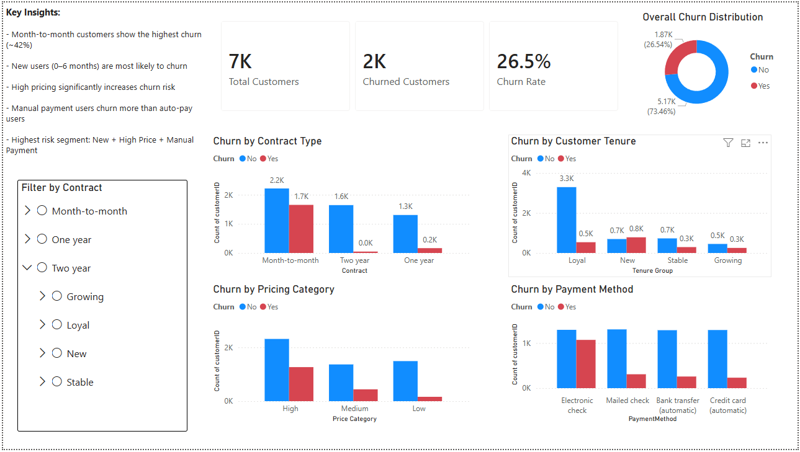

# Customer Churn Analysis & Retention Strategy

## 📌 Problem Statement
A telecom company is experiencing a high customer churn rate (~26.5%), impacting revenue and growth. This project analyzes customer behavior to identify key drivers of churn.

## 📊 Key Insights
- Month-to-month customers show the highest churn (~42%)
- New users (0–6 months) are most likely to churn
- High pricing significantly increases churn risk
- Manual payment users churn more than auto-pay users
- Highest risk segment: New + High Price + Manual Payment

## 💡 Business Recommendations
- Encourage long-term contracts through incentives  
- Improve onboarding for new users  
- Introduce entry-level pricing strategies  
- Promote auto-payment methods  
- Target high-risk segments with personalized retention strategies  

## 🛠 Tools Used
- SQL  
- Power BI  

## 📈 Outcome
Identified major churn drivers and provided actionable strategies to improve customer retention.

Dashboard=>

